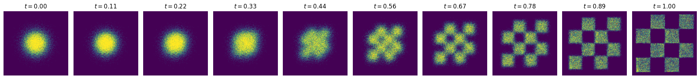

# 2D Flow Matching in JAX



This notebook implements a simple 2D flow matching model using JAX, equinox and diffrax. It trains a neural network to learn the velocity field that transforms samples from a standard Gaussian distribution to a target checkerboard distribution.

[](https://colab.research.google.com/github/marvinsxtr/jax-flow-matching/blob/main/jax_flow_matching.ipynb)

## Overview

This notebook implements flow matching on a 2D checkerboard dataset using an affine probability path $x_t = (1-t) \cdot x_0 + t \cdot x_1$ with $x_0 \sim \mathcal{N}(0, I)$. An MLP learns the velocity field $v_\theta(x, t)$ for ODE-based sampling and likelihood estimation via Hutchinson's trace estimator.

## Dependencies

This notebook requires the following JAX ecosystem packages:

- **[JAX](https://github.com/google/jax)**: Core library for high-performance numerical computing
- **[Equinox](https://github.com/patrick-kidger/equinox)**: Neural network library built on JAX
- **[Diffrax](https://github.com/patrick-kidger/diffrax)**: Differential equation solver for JAX
- **[jaxtyping](https://github.com/google/jaxtyping)**: Type annotations for JAX arrays
- **[Optax](https://github.com/deepmind/optax)**: Gradient processing and optimization library

Additional standard packages: `numpy`, `matplotlib`

## Container Setup

This implementation can be run using Docker or Apptainer containers for reproducible results.

### Docker (Local Machine)

1. **Install VSCode Dev Containers Extension**

   First, install the [Dev Containers](https://marketplace.visualstudio.com/items?itemName=ms-vscode-remote.remote-containers) extension in VSCode.

2. **Open the Repository in the Dev Container**

   Click the `Reopen in Container` button in the pop-up that appears once you open the repository in VSCode.

   Alternatively, open the command palette in VSCode by pressing `Shift+Alt+P` (Windows/Linux) or `Shift+Cmd+P` (Mac), and type `Dev Containers: Reopen in Container`.

### Apptainer (Cluster)

1. **Install VSCode Remote Tunnels Extension**

   First, install the [Remote Tunnels](https://marketplace.visualstudio.com/items?itemName=ms-vscode.remote-server) extension in VSCode.

2. **Launch container**

   To open a tunnel to connect your local VSCode to the container on the cluster:
   
   ```bash
   apptainer run --nv --writable-tmpfs oras://ghcr.io/marvinsxtr/jax-flow-matching:latest-sif code tunnel
   ```

   In VSCode press `Shift+Alt+P` (Windows/Linux) or `Shift+Cmd+P` (Mac), type "connect to tunnel", select GitHub and select your named node on the cluster. Your IDE is now connected to the cluster.

## Attribution

This implementation is based on concepts from the following sources:

- [Flow Matching Guide and Code](https://arxiv.org/abs/2412.06264)
- [Reference PyTorch Implementation](https://github.com/facebookresearch/flow_matching/blob/main/examples/2d_flow_matching.ipynb)
- [Flow Matching for Generative Modeling](https://arxiv.org/abs/2210.02747)
